# moodlexport

This Python module provides code which allows to easily generate families of questions (called *categories* in Moodle) that can be directly created from either Python or Latex document, and then directly exported into Moodle (through the Moodle XML import functionality), where they can be used to create a test. 

| Overview of the possible conversions done within moodlexport |
| --- |
| 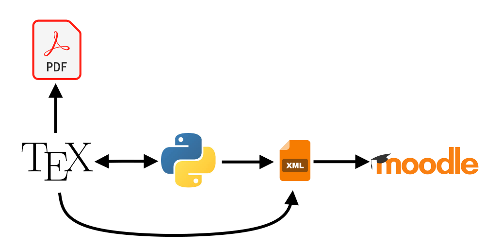 |

### Installing

It can be installed with a pip command : `pip install moodlexport`

### A quick overview of what this Module can do

This module focuses on two type of questions provided by Moodle : the `multichoice` question (the student chooses one or more answers among others), and the `essay` question (the student is provided a space to type its answer, or upload a document).

| An essay question | A multichoice question |
| --- | --- |
| 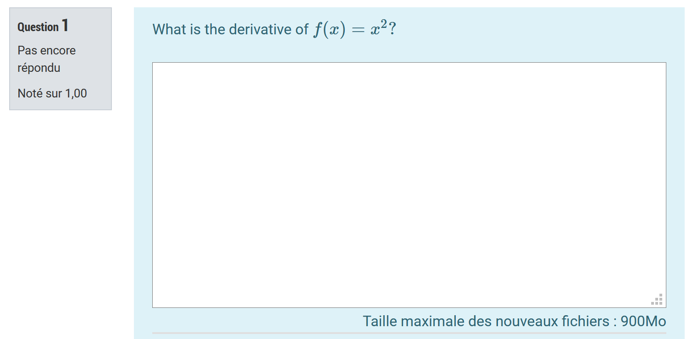 | 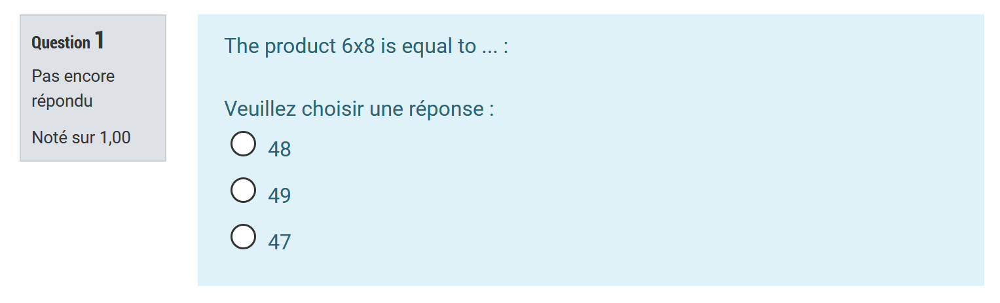 |

Say that you want to define a multiple choice question in Moodle. This requires a lot of parameters to tune, but for now let's focus on the essential : what you basically needs is

1. The body/text of your question
2. A list of potential answers
3. Setting which answer is the good one (see the documentation for more advanced settings like having more than one good answer)
4. Exporting that to Moodle

Here is a short overview on how to do that from Pyhton with `moodlexport`.

| Writing a multichoice question from Python |
| --- |
| 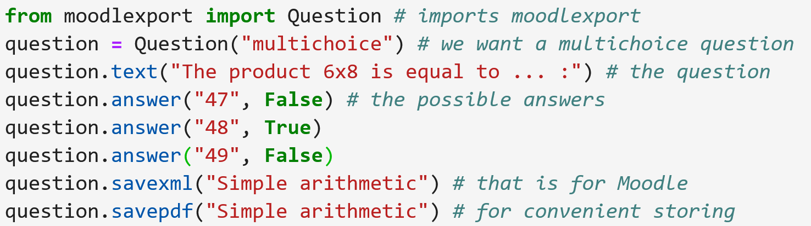 |
|  |
| 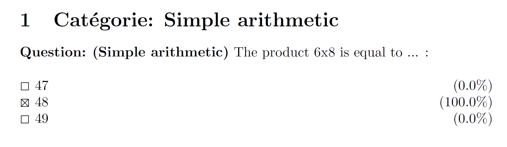 |
| From top to bottom: 1) the python code defining our question and producing a .xml file; 2) that question in Moodle after importing the .xml file; 3) a .pdf produced by the Python code, for convenience. You can find the corresponding code [here](examples/simplest_multichoice_question_from_python/template.ipynb) |

You could equivalently obtain the very same result by typing the question in a Latex file, and using moodlexport to convert it:

| Writing a multichoice question from Latex |
| --- |
| 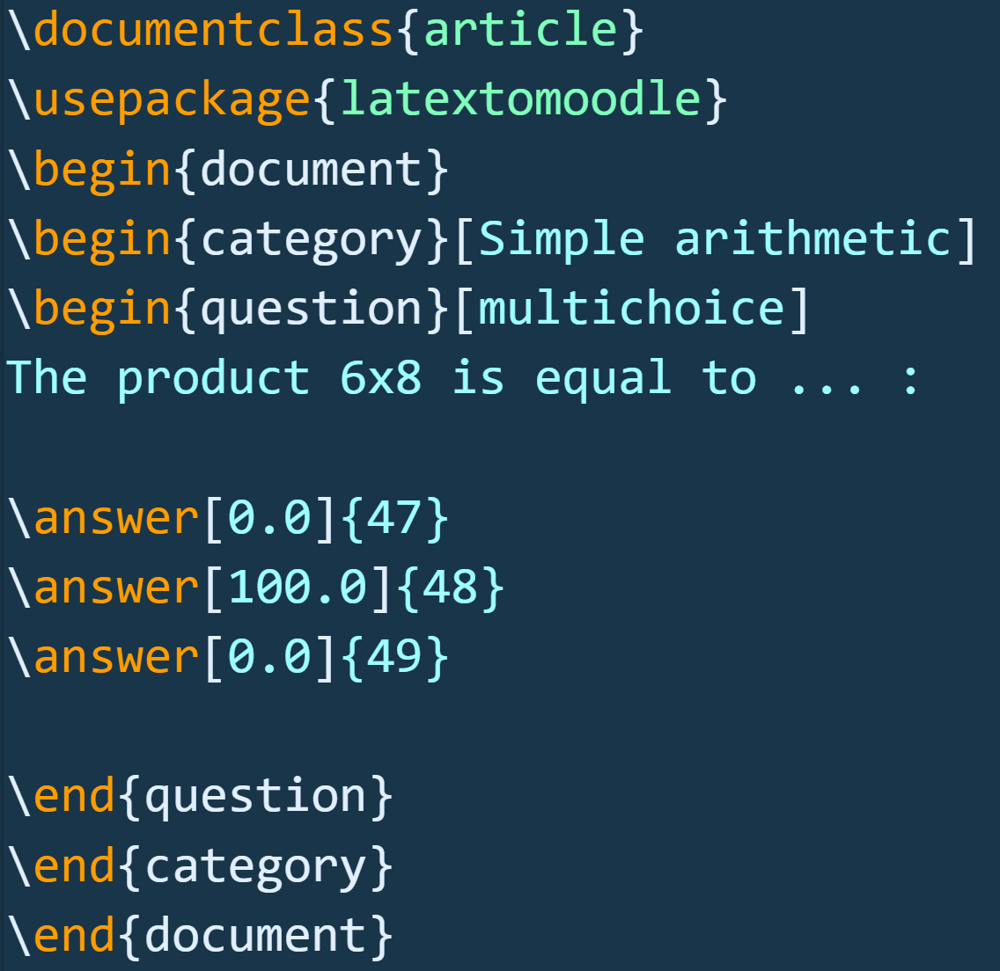 |
| 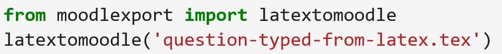 |
|  |
| A latex file defining a question, and then converted to an .xml by Python. You can find the corresponding code [here](examples/simplest_multichoice_question_from_latex/template.ipynb) |

To write an essay question, the syntax is as simple:

| Writing an essay question from Python |
| --- |
| 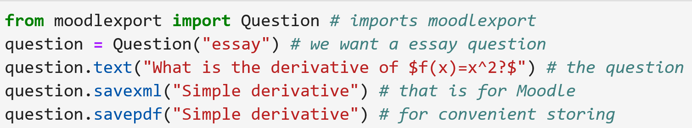 |
|  |
| 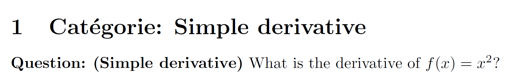 |
| From top to bottom: 1) the python code defining our question and producing a .xml file; 2) that question in Moodle after importing the .xml file; 3) a .pdf produced by the Python code, for convenience. You can find the corresponding code [here](examples/simplest_essay_question_from_python/template.ipynb) |

The interest of writing your questions in Python is that you can easily generate random problems. Suppose for instance that we want a random question where we ask the student if a polynomial equation $aX^2 + bX +c = 0$, with integer coefficients, has a solution or no.
One way to go is to generate a bunch of those questions, and then let Moodle pick one question at random among those during a `test`. Here is one way to do:

| Generating random questions |
| --- |
| 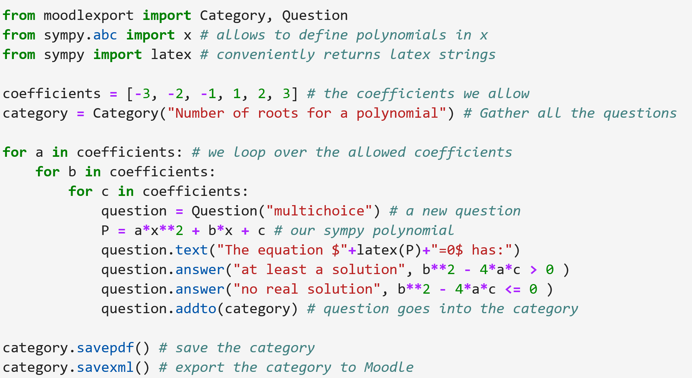 |
| 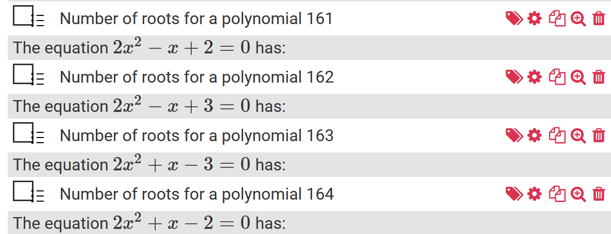 |
| 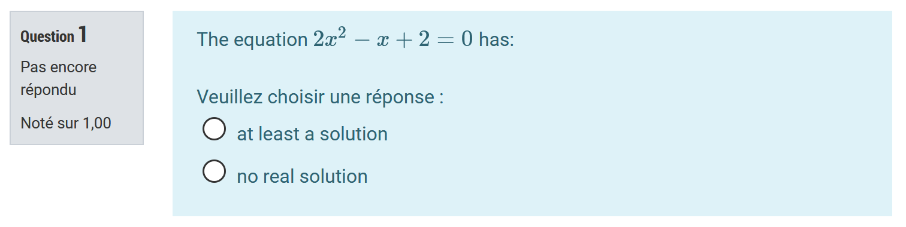 |
| 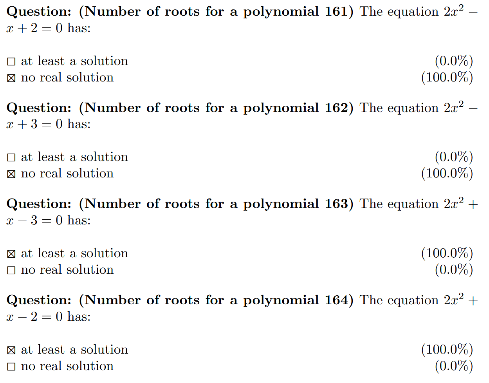 |
| From top to bottom: 1) the python code defining a category containing many variants of a same question, and producing a .xml file; 2) some of these questions appearing in a category in Moodle 3) one such question in Moodle; 4) a sample of the .pdf produced by the Python code. You can find the corresponding code [here](examples/simple_random_question/template.ipynb) |

### Motivation

The main motivation behind this module is that :  
- it is more comfortable to type maths in your day-to-day Latex interface than within Moodle
- it is easier to define mathematical objects (vectors, matrix) in Python than in Moodle
- generating **random problems** is quite intricate in Moodle, because we quickly face issues such as solutions being too complicated for the students (e.g. non integer), or Moodle being unable to handle certain student's answers (how would could Moodle interpret that $x+x$ is the same than $2x$?). This is much simpler to handle in Python.
- it is easier to manipulate locally a Latex or Python file than doing it on the Moodle interface. It also simplifies collaborating projects.
- it is more convenient to store/read questions/answers in pdf files, than using the Moodle 'bank of questions' interface.

## More advanced documentation

To read more about what this module can do, on how the parameters of your question can be set, see the complete documentation [here](doc/documentation.md).